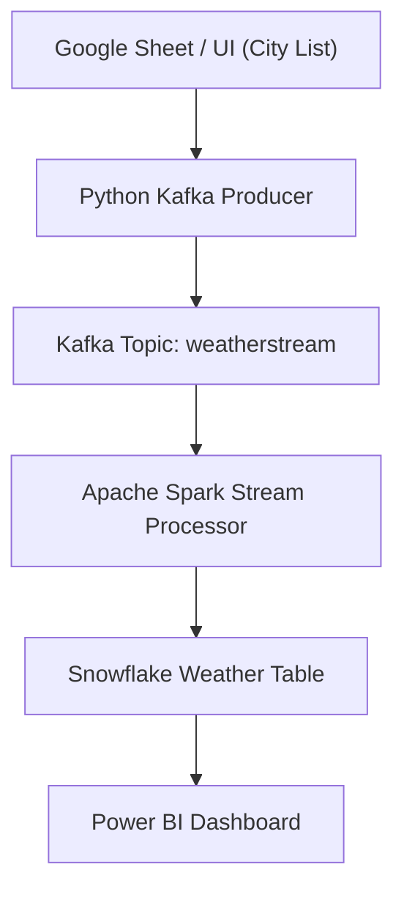

# 🌐 AutoBI - Real-Time Weather Business Intelligence System

AutoBI is a real-time data analytics pipeline that ingests weather data for dynamically selected cities, processes it using Apache Spark, stores it in Snowflake, and visualizes key insights in Power BI. The system is designed for scalability, modularity, and automation — making it ideal for smart cities, agriculture, logistics, or weather-based planning.

---

## 🚀 Features

- 🌦️ Real-time weather data ingestion from OpenWeatherMap API  
- 🏙️ Dynamic city selection (Google Sheets → Dashboard UI)  
- 🔄 Kafka-based streaming pipeline  
- 🔧 Real-time processing with PySpark  
- ❄️ Cloud data storage with Snowflake  
- 📊 Interactive Power BI dashboard with filters, visuals & insights  
- 🔐 Secure configuration management with `.gitignore` and modular secrets  
- 🧩 Easily extensible (alerts, AI predictors, stock/weather merge)

---

## 🛠️ Tech Stack

| Layer           | Tool/Technology                            |
|----------------|---------------------------------------------|
| 🌐 API Source    | OpenWeatherMap API                         |
| 🧪 Producer      | Python Kafka Producer                      |
| 📩 Messaging     | Apache Kafka                               |
| 🔀 Processing    | Apache Spark (PySpark)                     |
| 🗃️ Storage       | Snowflake Cloud Warehouse                  |
| 📊 Dashboard     | Power BI                                   |
| 🗂️ Orchestration | Cron Jobs (Airflow optional)              |
| ⚙️ Control UI    | Google Sheets → Flask/Streamlit UI (Future) |
| 🔐 Secrets Mgmt  | Python Config File + `.gitignore`          |

---


```markdown
## 🧩 Architecture Overview



## ✅ Project Status

| Task                                 | Status        |
|--------------------------------------|---------------|
| Set up Kafka and topic               | ✅ Done        |
| Build Kafka Producer for weather API | ✅ Done        |
| Fetch dynamic city list              | ✅ Done        |
| Kafka Consumer test                  | ✅ Done        |
| Spark streaming setup                | 🔜 In Progress |
| Push transformed data to Snowflake   | 🔜 In Progress |
| Power BI dashboard                   | 🔜 Planned     |
| Replace Google Sheet with UI         | 🔜 Planned     |
| Alert & AI modules                   | ⏳ Future      |

---

## 📥 Setup Instructions

### 1. Clone the repository

```bash
git clone https://github.com/your-username/AutoBI.git
cd AutoBI
```
### 2. Install dependencies

```bash
pip install -r requirements.txt
```
### 3. Add credentials

Create a file at `config/credentials.py` with the following content:

```python
OPENWEATHER_API_KEY = 'your_api_key'
SNOWFLAKE_USER = 'your_username'
SNOWFLAKE_PASSWORD = 'your_password'
SNOWFLAKE_ACCOUNT = 'your_account'
SNOWFLAKE_DATABASE = 'your_db'
SNOWFLAKE_SCHEMA = 'your_schema'
SNOWFLAKE_WAREHOUSE = 'your_warehouse'
```
### 4. Start Kafka Server

Make sure both **Zookeeper** and **Kafka broker** are running.

If installed locally, you can start them using:

```bash
# Start Zookeeper
bin/zookeeper-server-start.sh config/zookeeper.properties

# In a new terminal, start Kafka broker
bin/kafka-server-start.sh config/server.properties
```

### 5. Run Kafka Producer

Once the Kafka broker and Zookeeper are running, start the weather data producer script:

```bash
python pro-con/weather_producer.py
```

### 6. Run Spark Processor (in another terminal)

Run the Spark streaming job to consume messages from the Kafka topic and write transformed data to Snowflake:

```bash
spark-submit spark/spark_processor.py
```

### 7. Open Power BI and Connect to Snowflake

1. Open **Power BI Desktop** on your machine.
2. Click on **Get Data** → Select **Snowflake**.
3. In the dialog box, enter the following:
   - **Server**: `<your_account>.snowflakecomputing.com`
   - **Warehouse**: `<your_warehouse_name>`
   - **Database**: `<your_database_name>`
   - **Schema**: `<your_schema_name>`
4. Choose your **data connectivity mode**:
   - **DirectQuery** – Connect live to Snowflake for real-time analytics.
   - **Import** – Pull a static snapshot of the data for faster performance.
5. Load the **weather data table** and start designing your dashboard with visuals like:
   - Bar/line charts for temperature, humidity, etc.
   - Slicers for dynamic city/date selection
   - Conditional formatting for thresholds
   - Map visualizations using coordinates (optional)

> ✅ Make sure your Snowflake role has permission to access the selected database, schema, and table.

> 💡 You can use Power BI's **Scheduled Refresh** for daily/real-time updates if using Import mode.

